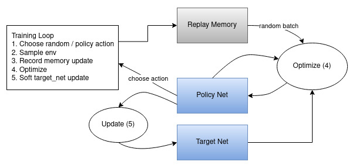

# Deep Q-Learning for CartPole-v1

A PyTorch implementation of Deep Q-Learning (DQN) to train an agent on the CartPole-v1 task from OpenAI's Gymnasium. This project demonstrates fundamental reinforcement learning concepts and serves as an educational tutorial for understanding DQN algorithms.


## Table of Contents

- [Overview](#overview)
- [The CartPole Task](#the-cartpole-task)
- [Deep Q-Learning Algorithm](#deep-q-learning-algorithm)
- [Features](#features)
- [Installation](#installation)
- [Usage](#usage)
- [Project Structure](#project-structure)
- [Implementation Details](#implementation-details)
- [Results](#results)
- [References](#references)
- [License](#license)

## Overview

This project implements a Deep Q-Network (DQN) agent that learns to balance a pole on a cart in the CartPole-v1 environment. The implementation follows the principles from the original DQN paper and includes modern improvements like experience replay and target networks.

The agent learns through trial and error, receiving rewards for keeping the pole upright and penalties when it falls. Over time, the neural network learns to predict the value of different actions in different states, enabling the agent to make better decisions.

## The CartPole Task



In the CartPole environment:
- **Objective**: Keep a pole balanced on a movable cart
- **Actions**: Move cart left (0) or right (1)
- **State Space**: 4 continuous values representing cart position, cart velocity, pole angle, and pole angular velocity
- **Rewards**: +1 for each timestep the pole remains upright
- **Episode Termination**: 
  - Pole angle exceeds ±12 degrees
  - Cart position exceeds ±2.4 units
  - Episode length reaches 500 timesteps (successful completion)

## Deep Q-Learning Algorithm

The DQN algorithm approximates the optimal action-value function Q*(s,a) using a deep neural network. Key components include:

### 1. Q-Network Architecture
- **Input**: 4 state observations (cart position, velocity, pole angle, angular velocity)
- **Hidden Layers**: Two fully connected layers with 128 neurons each
- **Output**: Q-values for each action (left/right)
- **Activation**: ReLU for hidden layers

### 2. Experience Replay
- Stores agent experiences in a replay buffer
- Samples random batches for training to break correlation between consecutive experiences
- Buffer capacity: 10,000 transitions

### 3. Target Network
- Separate network for computing target Q-values
- Soft updates using τ = 0.005 for stability
- Prevents moving target problem during training

### 4. ε-Greedy Exploration
- Balances exploration vs exploitation
- ε starts at 0.9 and decays exponentially to 0.01
- Decay rate controlled by EPS_DECAY = 2500

## Features

- **GPU/MPS Support**: Automatic device detection for CUDA, MPS (Apple Silicon), or CPU
- **Reproducible Results**: Fixed random seeds for consistent training
- **Real-time Visualization**: Live plotting of episode durations and moving averages
- **Hyperparameter Tuning**: Easily adjustable training parameters
- **Educational Comments**: Detailed explanations throughout the code

## Installation

### Prerequisites
- Python 3.7+
- PyTorch
- Gymnasium
- Matplotlib
- NumPy

### Setup
1. Clone this repository:
```bash
git clone https://github.com/yourusername/Deep-Q-Learning--CartPole.git
cd Deep-Q-Learning--CartPole
```

2. Install dependencies:
```bash
pip install torch gymnasium[classic_control] matplotlib numpy
```

3. Open the Jupyter notebook:
```bash
jupyter notebook Notebook.ipynb
```

## Usage

### Running the Training
Execute the cells in `Notebook.ipynb` sequentially. The main training loop will:

1. Initialize the environment and neural networks
2. Train for 600 episodes (GPU) or 50 episodes (CPU)
3. Display real-time progress with episode duration plots
4. Show final results upon completion

### Key Hyperparameters
```python
BATCH_SIZE = 128      # Replay buffer batch size
GAMMA = 0.99          # Discount factor
EPS_START = 0.90      # Initial exploration rate
EPS_END = 0.01        # Final exploration rate
EPS_DECAY = 2500      # Exploration decay rate
TAU = 0.005           # Target network update rate
LR = 3e-4             # Learning rate
```

### Expected Performance
- **Target**: Consistently achieve 500 timesteps (maximum episode length)
- **Training Time**: Typically converges within 600 episodes
- **Success Criteria**: 100-episode moving average above 475

## Project Structure

```
Deep-Q-Learning--CartPole/
├── Notebook.ipynb          # Main implementation notebook
├── README.md               # This file
└── Images/
    ├── cartpole.gif        # CartPole animation
    └── Overview.png        # Framework diagram
```

## Implementation Details

### Neural Network Architecture
```python
class DQN(nn.Module):
    def __init__(self, n_observations, n_actions):
        super(DQN, self).__init__()
        self.layer1 = nn.Linear(n_observations, 128)
        self.layer2 = nn.Linear(128, 128)
        self.layer3 = nn.Linear(128, n_actions)
```

### Loss Function
Uses Huber loss (SmoothL1Loss) for robust training:
- Acts like MSE for small errors
- Acts like MAE for large errors
- More stable than pure MSE

### Training Algorithm
1. **Experience Collection**: Agent interacts with environment
2. **Memory Storage**: Store (state, action, reward, next_state) transitions
3. **Batch Sampling**: Random sample from replay buffer
4. **Q-Value Computation**: Calculate current and target Q-values
5. **Loss Calculation**: Huber loss between predicted and target values
6. **Network Update**: Backpropagation and gradient clipping
7. **Target Update**: Soft update of target network

## Results

After successful training, the agent should:
- Achieve consistent 500-timestep episodes
- Show smooth learning curves with minimal variance
- Demonstrate stable pole balancing behavior
- Reach convergence within 600 training episodes

The training progress is visualized in real-time, showing both individual episode durations and 100-episode moving averages.

## References

- [Original DQN Paper](https://arxiv.org/abs/1312.5602) - Mnih et al., 2013
- [PyTorch DQN Tutorial](https://docs.pytorch.org/tutorials/intermediate/reinforcement_q_learning.html)
- [OpenAI Gymnasium](https://gymnasium.farama.org/) - Environment documentation
- [CartPole-v1 Environment](https://gymnasium.farama.org/environments/classic_control/cart_pole/)

## License

This project is open source and available under the MIT License.
